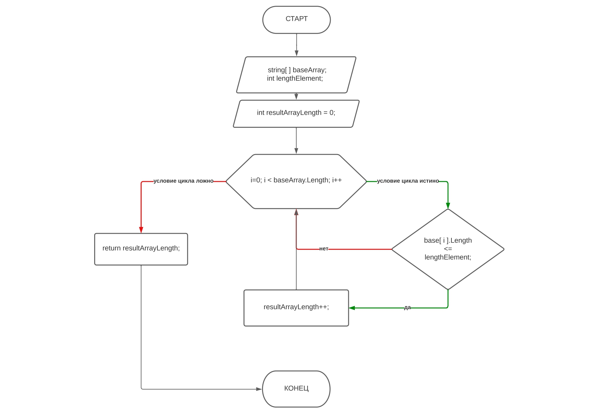
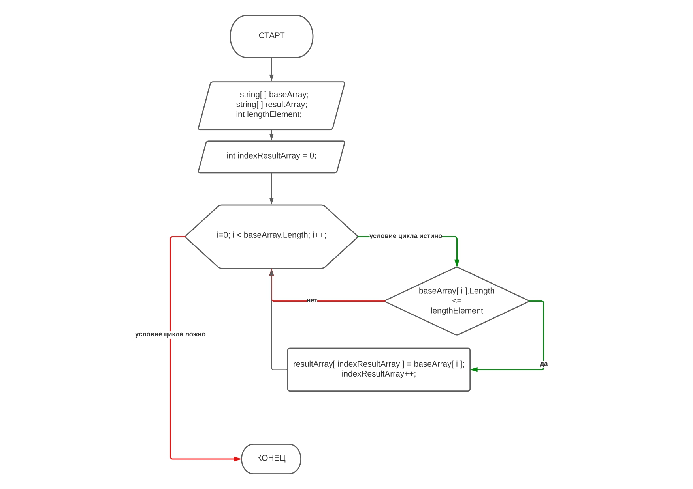

# Описание задачи и процесса её решения

## **Итоговая проверочная работа**  
Написать программу, которая из имеющегося массива строк формирует массив из строк, длина которых меньше либо равна 3 символа. Первоначальный массив можно ввести с клавиатуры, либо задать на старте выполнения алгоритма. При решении не рекомендуется пользоваться коллекциями, лучше обойтись исключительно массивами.  

Примеры:  
["hello","2","world",";-)"] -> ["2",":-)"]  
["1,2,3,4","1567","-2","computer science"] -> ["-2"]  
["Rissia","Denmark","Kazan"] ->[ ]  

## **Процесс решения поэтапно**
- **Этап №1** Создаем репозиторий на GitHub
- **Этап №2** Опишем два основных метода блок-схемами. Также опишем метод вывода массива в консоль и само тело программы поэтапно:
    - Метод заполнения массива вводом с клавиатуры;
    - Метод заполнения результирующего массива по ТЗ;
    - Метод вывода массива в консоль;
    - Тело программы
- **Этап №3** Реализуем методы и программу на языке C#

### **Этап №1** Репозиторий на GitHub
- Репозиторий доступен по ссылке: [Итоговый проект. Ссылка на GitHub](https://github.com/Akkenton/ProjedctSpec_1-chapter_MarinAA.git)
### **Этап №2** описание методов и алгоритма.

- Метод заполнения базового массива *FillBaseArrayAndReturnResultArrayLength( )* в виде блок-схемы алгоритма:

    Описание метода поэтапно:
    1. На вход метод принимает массив *baseArray* и переменную *lengthElement* (переменная явным образом задается в теле программы в соответствии с ТЗ).
    2. В теле метода объявляем локальную переменную resultArrayLength со значением 0. В неё будем записывать длину результирующего массива и выводить её return-ом.
    3. В цикле **for** проходим массив и ищем элементы, соответствующие условию  
    *base[i].Length <= lengthElement* (***в случае ТЗ - ищем элементы с длиной меньшей или равной 3***)
    Если условие истино, то увеличиваем переменную *resultArrayLength* на 1.
    4. После того как перебрали весь массив, выводим переменную *resultArrayLength* как результат выполнения метода.
  
- Метод заполнения результирующего массива *FillResultArray( )* в виде блок-схемы алгоритма:

    Описание метода поэтапно:
    1. На вход метод принимает массив *baseArray*, массив *resultArray* и переменную *lengthElement*.
    2. В теле метода объявляем локальную переменную indexResultArray со значением 0. В неё будем записывать индекс элемента результирующего массива.
    3. В цикле **for** проходим массив и ищем элементы, соответствующие условию  
    *base[i].Length <= lengthElement* (***в случае ТЗ - ищем элементы с длиной меньшей или равной 3***)
    Если условие истино, то записываем значение элемента массива *baseArray* в элемент массива *resultArray* и увеличиваем переменную *indexResultArray* на 1.
    4. После того как перебрали весь массив *baseArray*, метод заканчивает работу.

- Описание метод вывода массива в консоль *PrintArray( )*:  
  1. Получаем на вход массив *array*, который нужно вывести в консоль.
  2. Выводим открывающую квадратную скобку в консоль.
  3. В цикле **for** выводим массив в соответствии с ТЗ. В цикле присутствует условие, для корректного отображения последнего элемента(***без запятой***).
  4. Выводим закрывающую квадратную скобку в консоль.

- Краткое описание тела программы:
  1. Инициализируем массив *baseArray* типа **string** размерностью, указаной пользователем.
  2. Инициализируем переменную *lengthEelement* со значением ***3*** (***в соответствии с ТЗ***).
  3. Инициализируем переменную *resultArrayLength* со значением ***0***.
  4. Заполняем массив *baseArray* методом **FillBaseArrayAndReturnResultArrayLength( )** и записываем в переменную *resultArrayLength* результат работы данного метода. (***Здесь мы получаем длину результирующего массива***).
  5. Выводим заполненный массив *baseArray* методом **PrintArray( )**.
  6. Инициализируем массив *resultArray* типа **string**, длиной равной переменной *resultArrayLength*/
  7. Заполняем массив *resultArray* методом **FillResultArray( )**.
  8. Выводим заполненный массив *resultArray* методом **PrintArray( )**.

### **Этап №3** Код представлен в файле Program.cs